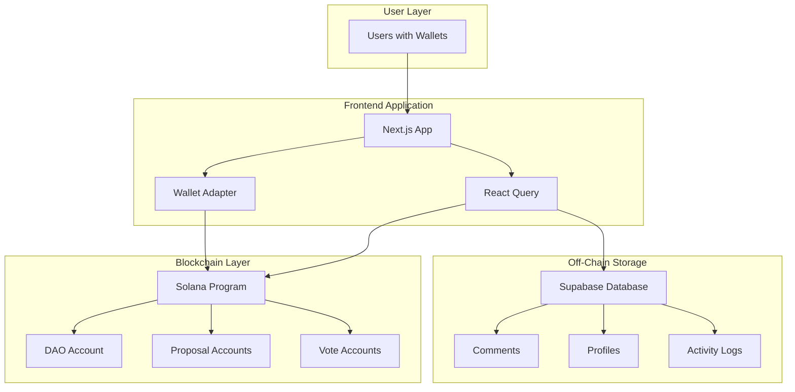

# DAO Voting Platform Documentation

Welcome to the comprehensive documentation for the Solana DAO Voting Platform - a decentralized governance application built on Solana that enables community-driven decision making through on-chain proposals and voting.

## Purpose

This platform empowers decentralized autonomous organizations (DAOs) to make collective decisions transparently and securely. Built on Solana's high-performance blockchain, it provides a robust governance framework that ensures every member's voice is heard while maintaining the integrity of the voting process.

## Key Features

### 🗳️ On-Chain Governance
- **Fully Decentralized**: All proposals and votes are recorded on the Solana blockchain
- **Transparent Process**: Every action is verifiable and auditable
- **Immutable Records**: Vote history cannot be altered or deleted

### 💼 Flexible Voting Mechanisms
- **Token-Weighted Voting**: Vote power based on token holdings
- **NFT-Gated Access**: Restrict voting to NFT collection holders
- **Configurable Quorum**: Customizable participation thresholds
- **Time-Locked Execution**: Automatic proposal execution after voting period

### 🚀 Modern User Experience
- **Wallet Integration**: Support for Phantom, Backpack, and Solflare wallets
- **Real-Time Updates**: Live vote counting and proposal status
- **Visual Analytics**: Interactive charts showing vote distribution
- **Mobile Responsive**: Optimized for all device sizes

## Audience

This documentation serves multiple stakeholders:

- **Developers**: Technical implementation details and API references
- **DAO Administrators**: Setup, configuration, and management guides
- **Operations Teams**: Deployment procedures and maintenance runbooks
- **End Users**: Feature guides and troubleshooting resources

## High-Level System Architecture

## Technology Stack

### Blockchain Infrastructure
- **Solana**: High-performance blockchain with sub-second finality
- **Anchor Framework**: Type-safe smart contract development
- **Program Derived Addresses (PDAs)**: Deterministic account generation

### Frontend Technologies
- **Next.js 14**: React framework with App Router
- **TypeScript**: Type safety across 50+ components
- **TailwindCSS + Radix UI**: Modern, accessible design system
- **React Query**: Intelligent data synchronization

### Supporting Services
- **Supabase**: PostgreSQL database for off-chain data
- **NextAuth**: Authentication and session management
- **Vercel**: Edge deployment and hosting

## Documentation Structure

This documentation is organized into the following sections:

1. **Architecture**: System design and technical decisions
2. **Smart Contracts**: On-chain program documentation
3. **Frontend**: User interface and component architecture
4. **Setup**: Local development environment configuration
5. **Deployment**: Production deployment procedures
6. **Features**: Detailed feature documentation
7. **API Reference**: Technical API documentation
8. **Testing**: Quality assurance procedures
9. **Operations**: Maintenance and troubleshooting guides

## Getting Started

For developers looking to run the platform locally:
- Start with [Local Development Setup](/docs/setup/local-development)
- Review the [Architecture Overview](/docs/architecture/overview)
- Explore the [Smart Contract Documentation](/docs/contracts/dao-program)

For deployment teams:
- Review [Local Development Setup](/docs/setup/local-development)
- Follow the [Production Deployment Guide](/docs/deployment/production-deployment)
- Set up [Operational Runbook](/docs/operations/runbook)

## Support and Resources

- **GitHub Repository**: [github.com/lazer/solana-dao-voting](https://github.com/lazer/solana-dao-voting)
- **Issue Tracker**: Report bugs and request features
- **Discord Community**: Get help and discuss improvements
- **Solana Documentation**: [docs.solana.com](https://docs.solana.com)

## Version Information

- **Current Version**: 1.0.0
- **Solana Program**: `7KqAtsakdPmWh1WMpokqMWKsGSNJ3S9He3kb9qtNHUaj`
- **Network**: Mainnet-Beta / Devnet
- **Last Updated**: December 2024